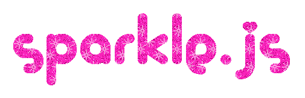

###  **[HOMEPAGE](http://anabastos.me/sparklejs) **

-=-=-=-=-=-=-=-=-=-=-=-=-=-=-=-=-=--=-=-=-=-=-=-=-=-=-=-=-=-=-=-=-=-=--=-=-=-=-=-=-=-=-=-=-=-=-=-=-=-

:sparkles: :star: Now your website can look like the past but on the future. :star: :sparkles:

**Sparkle.js** is a free, cute and 90s style library to make retro-looking websites on the world wide internet providing highly customizable geocities inspired effects and features like mouse sparkles :sparkles: and music :musical_note:.

We're inspired by the "anti-design brutalism" to make this lib and we think that the nostagia can have positive impact on the creativity and open a little bit the concept of what is good or bad design.

It's written Javascript using [Ramda.js](http://ramdajs.com/).

## * ~ Get Sparkled ~ *

Just import in your html the js :)

## * ~ Features ~ *

- [ ] Sparkling Cursor
- [ ] Custom Cursor
- [ ] Hit counter
- [ ] Online Users Counter
- [ ] Play music / playlist from spotify
- [ ] Custom Scrollbar
- [ ] Moving Objects

## * ~ License ~ *

Sparkle.js is available under the [WTFPL](http://www.wtfpl.net/) license which is how the internet was like in the 90s unless you put a watermark.
